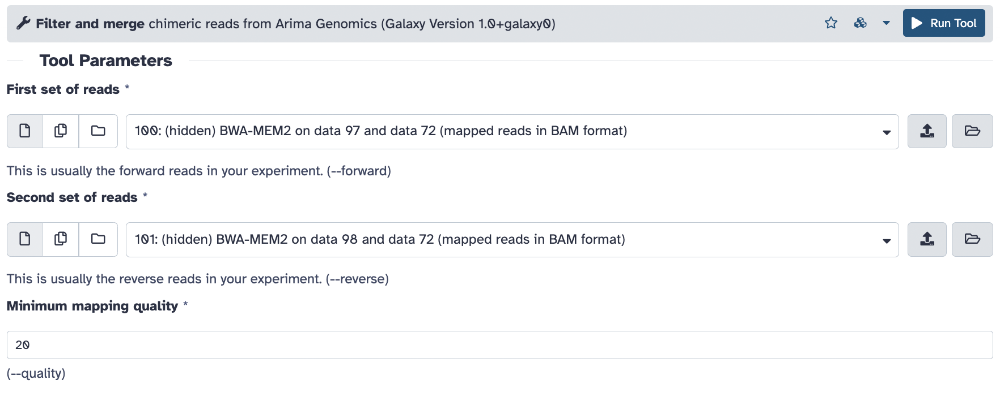

# Hi-C scaffolding

Goals:
* scaffold our contigs using Hi-C data
* evaluate the Hi-C contact maps

## BWA MEM2 (mapping R1 and R2 reads *separately*) on the contigs

[bwa mem2](https://github.com/bwa-mem2/bwa-mem2)


Note that we are treating the paired reads as separate, unpaired files. We need to get a name-sorted BAM (instead of the usual coordinate-sorted ones), because we will need to find pairs later on, and due to the nature of Hi-C sequencing, these pairs should have their R1 and R2 reads at distant coordinates from each other. 

```sh
bwa-mem2 index assembly.fasta
bwa-mem2 mem assembly.fasta R1_subseq_10pct.fastq.gz | samtools sort -n -O bam -o contigs_R1.bam
```

**Repeat this with the R2 data to create a `R2.bam`.**

## Bellerophon (Arima mapping pipeline)

[arima mapping pipeline](https://github.com/ArimaGenomics/mapping_pipeline/tree/master)

[bellerophon conda wrapper](https://bioconda.github.io/recipes/bellerophon/README.html)



Bellerophon is a conda wrapper for the Arima mapping pipeline. This step finds pairs and filters them to remove pairs with chimeric reads (reads that cover the ligation junction, thus artifically connecting two distant parts of the sequence).

```sh
bellerophon --forward contigs_R1.bam --reverse contigs_R2.bam --quality 20 --output contigs_merged.bam
samtools sort --no-PG -O bam -o contigs_merged_sorted.bam contigs_merged.bam
```

## Yet Another Hi-C Scaffolder (YaHS)

[YaHS](https://github.com/c-zhou/yahs)


```sh
yahs assembly.fasta merged_sorted.bam -o yahs_out
```

## BWA MEM2 (mapping R1 and R2 reads *separately*) on the scaffolds


To obtain the Hi-C contact map for our scaffolded assembly to assess the impact of scaffolding, we need to map the Hi-C reads to the scaffolded assembly. **Don't forget to do this for R2 as well.**

```sh
bwa-mem2 index scaffolds.fasta
bwa-mem2 mem scaffolds.fasta R1_subseq_10pct.fastq.gz | samtools sort -n -O bam -o scaffolds_R1.bam
```

Repeat this with the R2 data to create a `R2.bam`.

